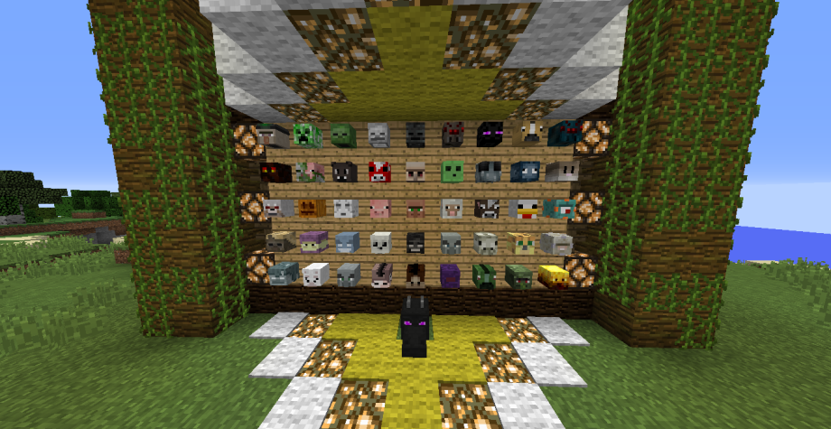

# PlayerHeads
Spigot plugin that allow get heads killing players and mobs.

This plugin is a refactor of Meiskan's plugin, he is the author of this plugin.
Him repository is https://github.com/meiskam/PlayerHeads

## Changes
The main change that I aggre is the mob heads generator. previously of this refactor the 
head could not be changeable because with each server restart, a internal code of heads changed.

So there are all mob heads.

